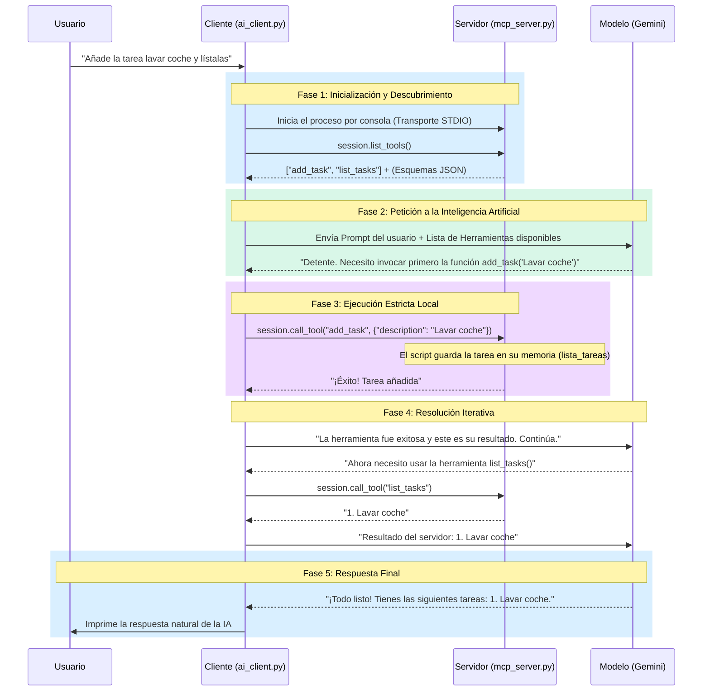

# Arquitectura y Funcionamiento: Proyecto Simple MCP

Esta guía detalla cómo está diseñado el sistema que acabas de ejecutar, las tecnologías empleadas y el flujo exacto bajo el capó.

---

## 📚 1. Tecnologías y Librerías Empleadas

- **Python (3.10+):** Lenguaje principal usado tanto para servidor como para cliente por su excelente compatibilidad con librerías de IA y operaciones asíncronas (`asyncio`).
- **`mcp` (SDK oficial):** La librería estándar liberada por Anthropic que facilita la creación tanto de clientes como de servidores MCP.
- **`FastMCP`:** Un envoltorio ligero que viene incluido dentro de la librería `mcp`. Transforma la tediosa tarea de registrar esquemas JSON en simples decoradores de funciones (`@mcp.tool()`).
- **`google-genai`:** El SDK oficial de Google para usar la API de Gemini, permitiendo enviar herramientas mediante `Function Declarations` (Function Calling).
- **`python-dotenv`:** Usado para leer la variable de entorno desde un archivo `.env` de forma limpia y segura (como se vio en tus recientes cambios).

---

## 🧠 2. Conceptos Importantes sobre MCP

El **Model Context Protocol (MCP)** es un estándar abierto impulsado por Anthropic cuyo propósito es "enchufar" los modelos de IA de forma segura a bases de datos, APIs y el entorno local del usuario. Es como si fuese el _"USB de las Inteligencias Artificiales"_.

En este sistema usamos los siguientes conceptos clave:

1. **MCP Server (El Proveedor):** La aplicación (`mcp_server.py`) que tiene acceso directo a tus recursos locales. Su trabajo es exponer sus capacidades sin tener que conectarse él mismo a la IA, de forma completamente autónoma y segura.
2. **Tools (Herramientas):** Un tipo de capacidad en MCP. Son funciones que el servidor permite que la IA ejecute de manera indirecta. Al iniciarse, el servidor las publica enviando el nombre, la descripción y un _JSON Schema_ de los parámetros necesarios para ejecutarlas.
3. **MCP Client (El Entorno):** La aplicación (`ai_client.py`) que aloja la conversación principal con el usuario. Sirve de puente entre el Modelo de Lenguaje (LLM) y el Servidor MCP. Existen clientes comerciales que puedes usar con tu servidor (como Claude Desktop, Cursor, o Windsurf).
4. **Transporte STDIO (Standard Input/Output):** La vía por la que el Cliente y el Servidor intercambian información. En lugar de usar internet, puertos o HTTP, se comunican imprimiendo mensajes JSON en los flujos de entrada y salida estándar del sistema operativo local. Es más seguro y no requiere configuración de red.

---

## ⚙️ 3. El Flujo de Funcionamiento (Paso a Paso)

Todo el proceso sucede mediante una "triangulación" de información: `Usuario -> Cliente -> LLM -> Cliente -> Servidor Local -> Cliente -> LLM`.

A continuación tienes un diagrama de flujo:

### Explicación Extensa del Flujo

1. **Arranque:** Cuando inicias `ai_client.py`, éste dispara por debajo un comando para iniciar tu servidor `python mcp_server.py`.
2. **Descubrimiento de herramientas:** El Cliente hace el primer requerimiento MCP al servidor recién creado: _¿Qué herramientas ofreces?_. El servidor le entrega `add_task` y `list_tasks`, incluyendo las descripciones (el texto que pusimos en los `docstrings`).
3. **Traducción del Esquema:** Las herramientas en el protocolo MCP están formateadas en _JSON Schema_, por lo que el script Cliente recibe esto y hace un bucle para convertirlas a las estructuras que Gemini entiende nativamente (`types.FunctionDeclaration`).
4. **Petición al LLM:** Tu instrucción natural junto con el compendio de herramientas traducidas se envían a Gemini. Gemini evalúa la situación: _"Me han pedido que añada una tarea. ¡Hay una herramienta que se llama `add_task` cuya descripción concuerda exactamente con lo que el usuario quiere que haga!"_.
5. **Function Calling (Llamada a Funciones):** Gemini detiene la generación de lenguaje natural y en su lugar devuelve al Cliente un comando estructurado pidiendo el uso de una herramienta (esto es lo que técnicamente se conoce como `Function Calling`).
6. **Ejecución Local Relegada:** **Gemini NUNCA ejecutó el código.** Quien ejecuta el código en tu ordenador siempre es tu `ai_client.py` a través de llamar, por ti, a la sesión estandarizada en STDIO del `mcp_server.py`. Por esto MCP es seguro; la IA no tiene control total de tu máquina, sino solo la intencionalidad semántica de qué herramientas accionar con qué argumentos.
7. **Resolución (_While loop_ en ai_client):** El cliente le pasa el string resultante de la función local de nuevo a Gemini. Al ver Gemini que ya tiene la información de la base de datos local necesaria, genera la respuesta final y concluye de manera empática.

### 🚀 Extensibilidad

Con esta arquitectura ya tienes un armazón robusto y simple. Si quisieras otorgar a tu IA la capacidad de, por ejemplo, **gestionar archivos excel, leer un PDF local, o prender las luces usando un script**, únicamente necesitarías escribir una función normal de Python en `mcp_server.py` y decorarla con `@mcp.tool()`.

El Cliente de IA en `ai_client.py` descubriría tu nueva herramienta automáticamente y Gemini aprendería a usarla en cuestión de milisegundos sin cambiar una sola línea de código del lado del cliente.
